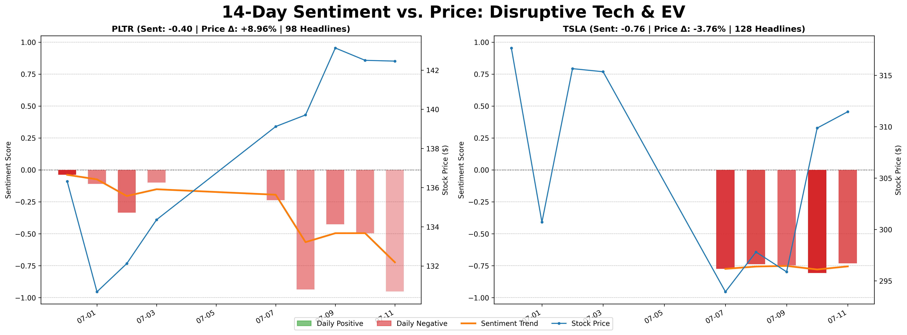
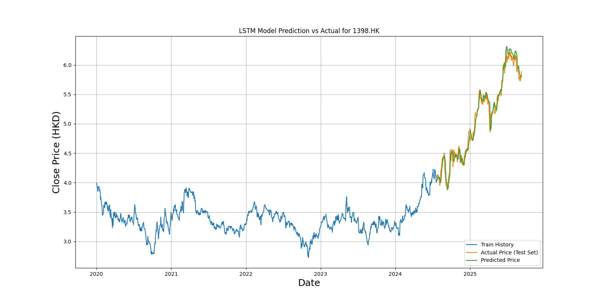

# Algorithmic Trading Analysis Toolkit

This repository contains a collection of Python scripts for performing quantitative analysis, sentiment analysis, and algorithmic trading strategies on stock market data. It features various tools for data fetching, technical analysis, portfolio optimization, and machine learning-based predictions.

## ✨ Key Features

- **Technical Analysis:** Calculates and visualizes common indicators like Moving Averages (SMA/EMA), Relative Strength Index (RSI), and MACD.
- **Sentiment Analysis:** 
    - Fetches news headlines from Finnhub and analyzes sentiment using pre-trained NLP models (`nltk`, `transformers`).
    - Analyzes sentiment of hardcoded financial news articles.
- **Portfolio Optimization:**
    - Maximizes the Sharpe Ratio for a given portfolio of stocks.
    - Dynamically adjusts portfolio weights based on LSTM-predicted returns and a volatility cap.
- **Machine Learning Predictions:**
    - Uses LSTM neural networks to predict future price trends for individual stocks and portfolios.
    - Employs Linear Regression for baseline price forecasting.
- **Risk Analysis:** Performs Principal Component Analysis (PCA) to identify the main risk factors within a stock portfolio.
- **Strategy Backtesting:** Includes a grid search script to find the optimal parameters for a Moving Average Crossover strategy.

## 🛠️ Tech Stack

- **Core Libraries:** Python 3.11, Pandas, NumPy
- **Data & APIs:** yfinance, Alpha Vantage, Finnhub
- **Machine Learning:** TensorFlow (Keras), PyTorch, Scikit-learn
- **NLP:** NLTK, Hugging Face Transformers
- **Plotting:** Matplotlib, Seaborn

## 📂 Project Structure

The repository is organized to separate source code from generated results, making it clean and easy to navigate.

```
/Algorithm_Trading/
├── .gitignore
├── README.md
├── requirements.txt
├── .env
├── src/
│   ├── algorithmtrading_gridsearch.py
│   ├── investment_analyzer.py
│   ├── portfolio_weight.py
│   ├── sharpe_ratio.py
│   ├── vantage_API.py
│   ├── hk_stock/
│   ├── us_stock/
│   └── sentimental_analysis/
└── results/
    ├── hk_stock/
    └── sentimental_analysis/
```

- **`src/`**: Contains all core Python scripts.
- **`results/`**: The default output directory for all generated charts and analysis files.
- **`requirements.txt`**: A list of all Python dependencies.
- **`.env`**: File for storing private API keys (this is ignored by git).

## 🚀 Getting Started

### 1. Clone the Repository
```bash
git clone <repository-url>
cd Algorithm_Trading
```

### 2. Set Up the Conda Environment
It is highly recommended to use Conda to manage the complex dependencies of this project.

```bash
# Create a new conda environment named 'trade' with Python 3.11
conda create -n trade python=3.11 -y

# Activate the environment
conda activate trade

# Install all required packages from requirements.txt
pip install -r requirements.txt
```
*Note: The environment setup has been tested on an Apple Silicon (M2) Mac. Some dependencies, especially for deep learning, might require different installation steps on other architectures.*

### 3. Configure API Keys
This project uses API keys from Finnhub and Alpha Vantage.

1.  Create a file named `.env` in the root directory of the project.
2.  Add your API keys to the file in the following format:

    ```
    FINNHUB_API_KEY="YOUR_FINNHUB_KEY_HERE"
    ALPHAVANTAGE_API_KEY="YOUR_ALPHAVANTAGE_KEY_HERE"
    ```

## 📈 Usage Examples

All scripts should be run from the root directory of the project.

### Example 1: Run the Full Sentiment and Price Analysis
This script fetches live data, performs sentiment analysis, and generates comprehensive plots.

```bash
python src/sentimental_analysis/sentient_analysis_api.py
```

### Example 2: Run the Investment Analyzer
This script fetches data for a portfolio, predicts trends with an LSTM model, performs PCA risk analysis, and generates recommendations.

```bash
python src/investment_analyzer.py
```

## 📊 Sample Output

Here are some examples of the charts generated by the analysis scripts.

**Sentiment vs. Price Analysis:**


**LSTM Price Prediction:**



## Disclaimer

This project is for educational and demonstration purposes only. The analyses and predictions generated are not financial advice. Trading stocks involves substantial risk.